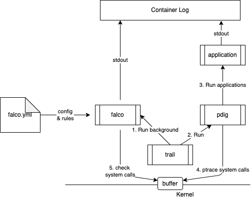

# falco-on-distroless-fargate

## Architecture



## on Local
Only supports x86_64 arch.

```shell
$ git clone https://github.com/tomoyamachi/falco-on-distroless-fargate --recursive
$ docker build -t falco-on-distroless .
$ docker run --cap-add=SYS_PTRACE --rm -it falco-on-distroless
...
2021/05/22 03:50:40 successfully create /1621655440.txt
{"output":"2021-05-22T03:50:40.138501500+0000: Error File below / or /root opened for writing (user=root user_loginuid=-1 command=app parent=pdig file=/1621655440.txt program=app container_id=d7e667dd5b42 image=<NA>)","priority":"Error","rule":"Write below root","time":"2021-05-22T03:50:40.138501500Z", "output_fields": {"container.id":"d7e667dd5b42","container.image.repository":null,"evt.time.iso8601":1621655440138501500,"fd.name":"/1621655440.txt","proc.cmdline":"app","proc.name":"app","proc.pname":"pdig","user.loginuid":-1,"user.name":"root"}}
2021/05/22 03:50:45 successfully create /1621655445.txt
{"output":"2021-05-22T03:50:45.140586300+0000: Error File below / or /root opened for writing (user=root user_loginuid=-1 command=app parent=pdig file=/1621655445.txt program=app container_id=d7e667dd5b42 image=<NA>)","priority":"Error","rule":"Write below root","time":"2021-05-22T03:50:45.140586300Z", "output_fields": {"container.id":"d7e667dd5b42","container.image.repository":null,"evt.time.iso8601":1621655445140586300,"fd.name":"/1621655445.txt","proc.cmdline":"app","proc.name":"app","proc.pname":"pdig","user.loginuid":-1,"user.name":"root"}}
...
```

## on ECS Fargate

Add SYS_PTRACE capability to containers. ([sysdig blog](https://sysdig.com/blog/falco-support-on-aws-fargate/)) 

```shell
"linuxParameters": {"capabilities":{"add":["SYS_PTRACE"]}}
```